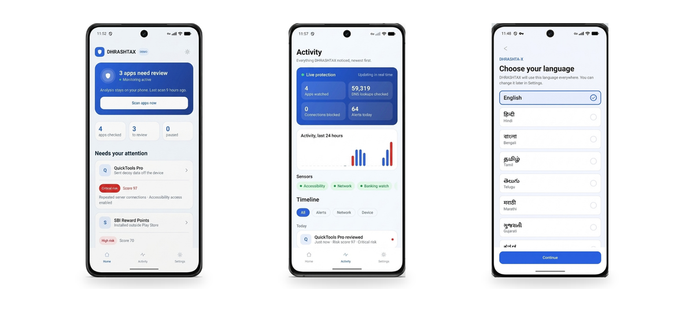
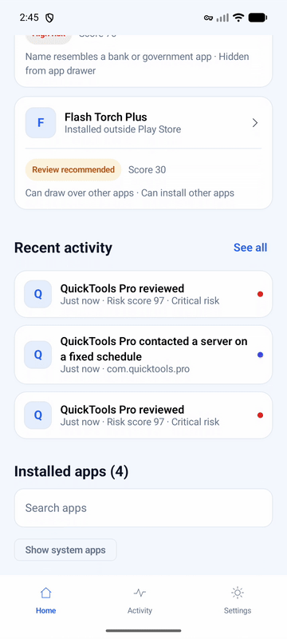
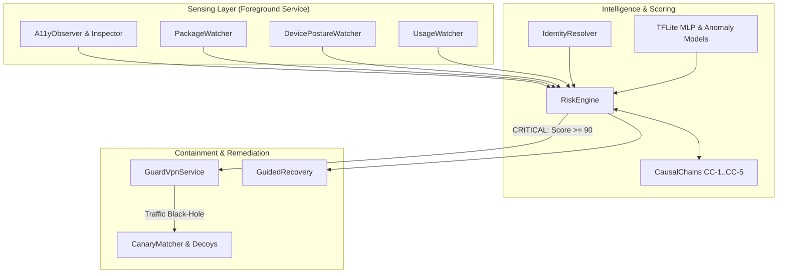
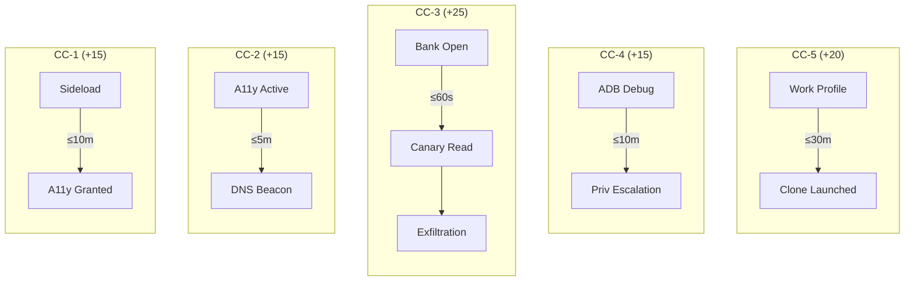

<div align="center">

# DHRASHTA-X

Autonomous, zero-telemetry Endpoint Detection and Response (EDR) and threat containment system for Android (API 26–34).

[](https://kotlinlang.org)
[](https://developer.android.com)
[](https://developer.android.com/compose)
[-0D9488.svg?style=flat)](https://github.com/srinivasr/iqoo)

<p align="center">
  <a href="#overview">Overview</a> •
  <a href="#visual-tour">Visual Tour</a> •
  <a href="#how-it-compares">Comparison</a> •
  <a href="#architecture">Architecture</a> •
  <a href="#temporal-causal-chains">Causal Chains</a> •
  <a href="#network-containment">Quarantine</a> •
  <a href="#quick-start">Quick Start</a>
</p>

</div>

## Overview

Modern Android banking trojans (TeaBot, SharkBot, Anubis, Hook) evade traditional mobile antivirus by staging operations across time: sideloading payloads, requesting accessibility rights, waiting for bank apps to open, and stealing OTPs or credentials through overlays.

Standard antivirus products rely on static APK hash lookups or upload user logs to cloud backends. DHRASHTA-X runs completely on-device with zero telemetry. It evaluates chronological causal event sequences over a 60-minute rolling window and applies surgical per-app network quarantine when malicious patterns trigger.

- All event sensing, neural inference, and containment policies execute locally. No logs, packet dumps, or app inventories leave the device.
- Order-aware causal chains evaluate sequences across time (such as Sideload &rarr; Accessibility &rarr; Banking foreground &rarr; Network exfiltration) rather than isolated install-time permissions.
- An on-device VPN black-holes network traffic exclusively for flagged packages while leaving other apps untouched.
- Synthetic canary decoy markers (`DHRX-*`) across contacts and credentials detect covert unencrypted exfiltration instantly.
- On-device explanations translate security decisions into plain English, Hindi, and regional languages with Text-to-Speech support.

## Visual Tour

<p align="center">
  
</p>

<p align="center">
  <em>Left to right: (1) Home dashboard with threat scores and pending reviews; (2) Activity timeline with sensor telemetry and hourly breakdown; (3) First-launch language selection.</em>
</p>

<h3 align="center">Threat Evaluation & Network Containment</h3>

<p align="center">
  <a href="docs/assets/demo-video.mp4">
    
  </a>
</p>

<p align="center">
  <em>Screen capture of threat scoring and per-app isolation. Click the preview to watch the full recording (<a href="docs/assets/demo-video.mp4">demo-video.mp4</a>).</em>
</p>

## How It Compares

| Feature | Traditional Antivirus | Google Play Protect | DHRASHTA-X |
|---|---|---|---|
| Data Privacy | Cloud uploads of APKs and logs | Cloud telemetry sync | Zero cloud telemetry (100% on-device) |
| Inspection Timing | Periodic install-time scans | Background scans | Continuous foreground service |
| Sequence Awareness | Static permission check | Static app check | Order-aware causal chains (60m window) |
| Accessibility Abuse | Static manifest check | Warning on unknown sources | Heuristic inspector + TFLite MLP model |
| Network Containment | Manual uninstall prompt | Disables package | Surgical per-UID TUN black-holing |
| Exfiltration Proof | None | None | Synthetic canary tokens (`DHRX-*`) |
| Remediation & Voice | Opaque error codes | Generic alerts | Multilingual explanations + TTS |

## Architecture

The runtime operates across five local stages: collection, dual scoring, risk enforcement, remediation, and offline database persistence.



<details>
<summary><strong>View Sensing Subsystem Watchers</strong></summary>

| Watcher | Mechanism | Signals & Events Detected |
|---|---|---|
| `A11yObserver` | `ContentObserver` on secure accessibility settings | `a11y_enabled`, `privilege_change`. Initiates background package evaluation. |
| `A11yInspector` | `AccessibilityManager.getEnabledAccessibilityServiceList` | Inspects flags: `isAccessibilityTool`, gesture control, key-event filtering. |
| `PackageWatcher` | BroadcastReceiver on `ACTION_PACKAGE_ADDED` | Flags sideloaded packages (`installer != com.android.vending`). |
| `DevicePostureWatcher` | `ContentObserver` on `ADB_ENABLED` and managed profiles | Detects developer/wireless debugging activation (`adb_enabled`) and profile creation. |
| `UsageWatcher` | Polling `UsageStatsManager.queryEvents` | Detects when protected banking and UPI apps enter the foreground. |
| `IdentityResolver` | Android `PackageManager` | Verifies certificate fingerprints, launcher activity presence, and overlay permissions. |

</details>

## Temporal Causal Chains

Single permissions are rarely proof of compromise. DHRASHTA-X correlates sequenced attacker techniques across a rolling 60-minute window:



| Chain | Event Sequence | Window | Score | Attack Pattern Stopped |
|---|---|---|---|---|
| `CC-1` | Sideload &rarr; Enable Accessibility | 10 min | +15 | Dropper installs payload and requests immediate accessibility control. |
| `CC-2` | Accessibility Enabled &rarr; DNS Beaconing | 5 min | +15 | Accessibility granted, followed by immediate periodic C2 check-in. |
| `CC-3` | Banking in Foreground &rarr; Canary Read &rarr; Exfiltration | 60 sec | +25 | User opens banking app; malware harvests decoy data and transmits it. |
| `CC-4` | Debugging Enabled &rarr; Privilege Escalation | 10 min | +15 | Attacker enables ADB bridge to grant higher system permissions. |
| `CC-5` | Work Profile Created &rarr; Cloned App Launched | 30 min | +20 | Rogue work profile used to clone and manipulate banking apps. |

## Scoring & Risk Bands

Risk scores are computed as:

$$\text{Score} = \max\left(0, \sum_{s \in \text{FiredSignals}} \text{Weight}(s) + \text{CausalBonus}\right)$$

| Band | Score | Action |
|---|---|---|
| `SAFE` | 0–29 | Normal operations. Clean posture. |
| `REVIEW` | 30–59 | Suspicious indicators present. Recommend user review. |
| `HIGH` | 60–89 | High threat probability. Prompt user alert with guided remediation. |
| `CRITICAL` | $\ge 90$ | Active threat confirmed. Automatic per-UID network quarantine. |

<details>
<summary><strong>View Key Signal Weights</strong></summary>

| Signal | Weight | Description | Category |
|---|---|---|---|
| `HIGH_TAINT_MATCH` | +50 | Planted canary token observed leaving the device | Exfiltration |
| `B4` | +50 | Signing certificate SHA-256 matches threat database | Known Threat |
| `B6` | +20 | App label or package mimics a banking or financial brand | Phishing |
| `E4` / `E5` | +20 | Network anomaly or accessibility neural model trigger | On-Device ML |
| `A1` | +15 | Enabled service is not a registered `isAccessibilityTool` | Accessibility |
| `A6` | +15 | Accessibility enabled within 10 minutes of install | Timing |
| `B1` | +15 | Sideloaded (installed outside Google Play) | Provenance |
| `B5` | +15 | App has no launcher icon (stealth app) | Concealment |
| `C1` | +10 | Requests `SYSTEM_ALERT_WINDOW` (overlay permission) | UI Hijacking |
| `N1` | -30 | Registered `isAccessibilityTool` + Google Play install | Neutralizing |
| `N2` | -100 | Package present in user allow-list | Neutralizing |

</details>

## Network Containment

`GuardVpnService` implements two operational states via Android's native `VpnService`:

### Passive DNS Monitor Mode

Active by default when no applications are quarantined:
- Forwards port 53 traffic to analyze lookup periodicity.
- Calculates coefficient of variation ($CV = \sigma / \mu$); queries with $CV < 0.15$ outside CDNs are flagged as periodic beacons.
- Inspects outbound buffers for planted canary decoy tokens (`DHRX-` prefixes).

### Active Per-UID Quarantine Mode

Triggered automatically when an app reaches the `CRITICAL` risk band ($\ge 90$) or when paused manually:
- Uses `addAllowedApplication(pkg)` to bind strictly to quarantined packages.
- Drains outbound packets without forwarding to the network, black-holing the malicious application while keeping all other apps connected.

## Quick Start

### Prerequisites
- OpenJDK 17
- Android SDK (API 34, Build Tools 34.0.0)
- Android device or emulator running Android 8.0+ (API 26+)

### Build & Run

```bash
# 1. Export Android SDK & JDK paths
source scripts/android-env.sh

# 2. Run unit tests
./gradlew test

# 3. Compile and install debug APK
./gradlew assembleDebug
adb install -r app/build/outputs/apk/debug/app-debug.apk

# 4. Launch main activity
adb shell am start -n com.dhrashta.x/.ui.MainActivity
```

## Project Structure

```
iqoo/
├── app/src/main/
│   ├── AndroidManifest.xml        # Declarations, permissions, foreground services
│   ├── assets/threats.json        # Offline threat hashes and package signatures
│   └── java/com/dhrashta/x/
│       ├── ai/                    # On-device TFLite classifiers & MediaPipe LLM
│       ├── data/                  # Room database, DAOs, entities, allowlists
│       ├── decision/              # RiskEngine, CausalChains, signal catalogue
│       ├── enforcement/           # GuardVpnService, CanaryManager, BeaconDetector
│       ├── sensing/               # System watchers (A11y, Package, Posture, Usage)
│       └── ui/                    # Jetpack Compose screens, dashboard, localized strings
├── docs/assets/                   # Architecture diagrams, showcase screenshots, video demo
└── PROJECT_CONTEXT.md             # Complete technical architecture specification
```
